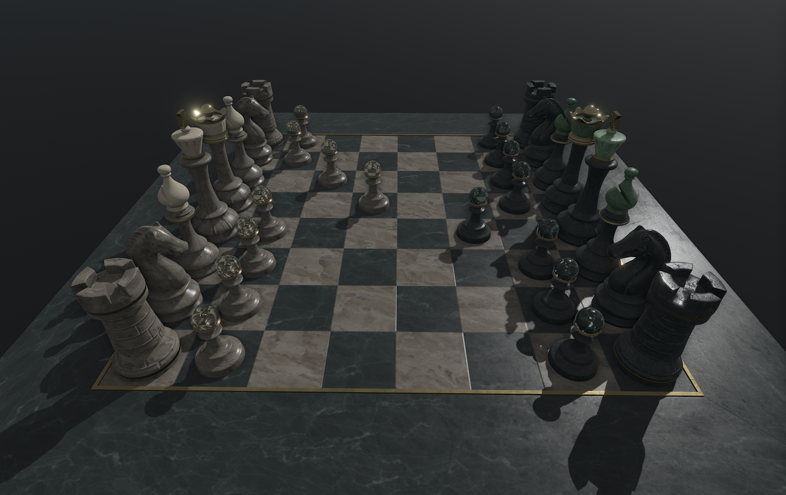
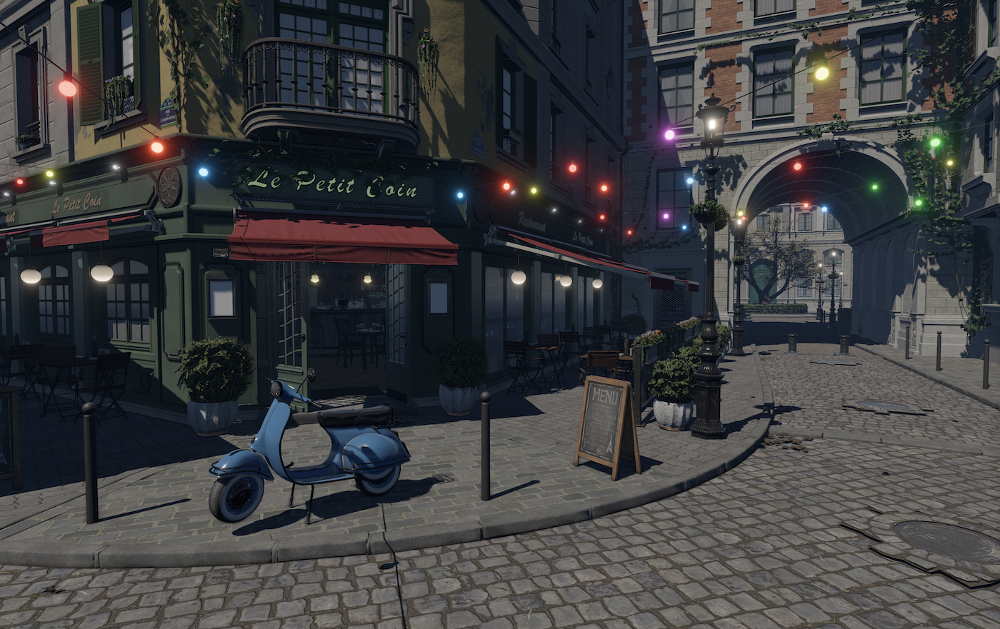
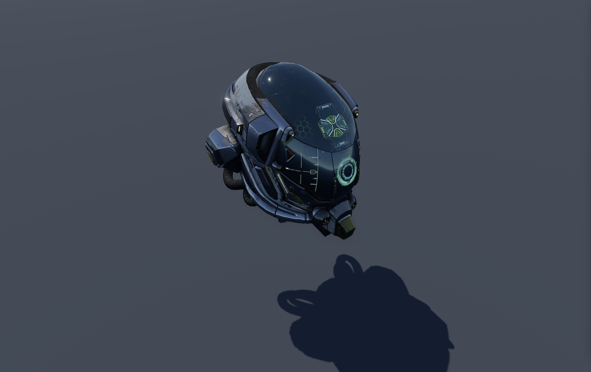
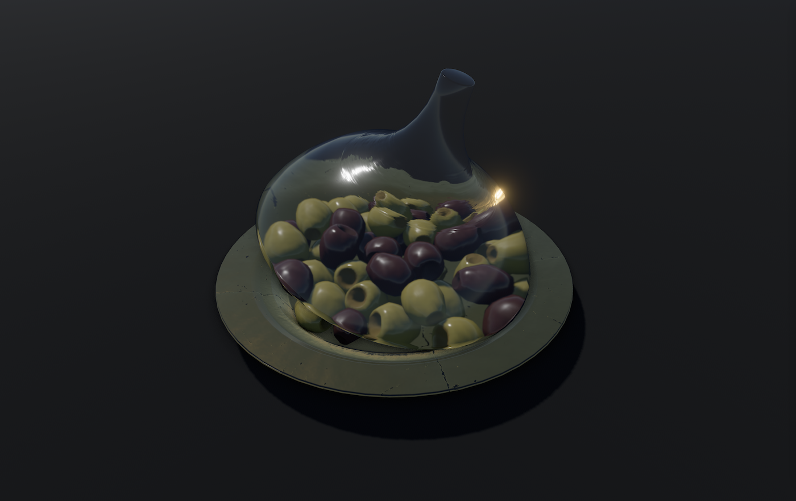
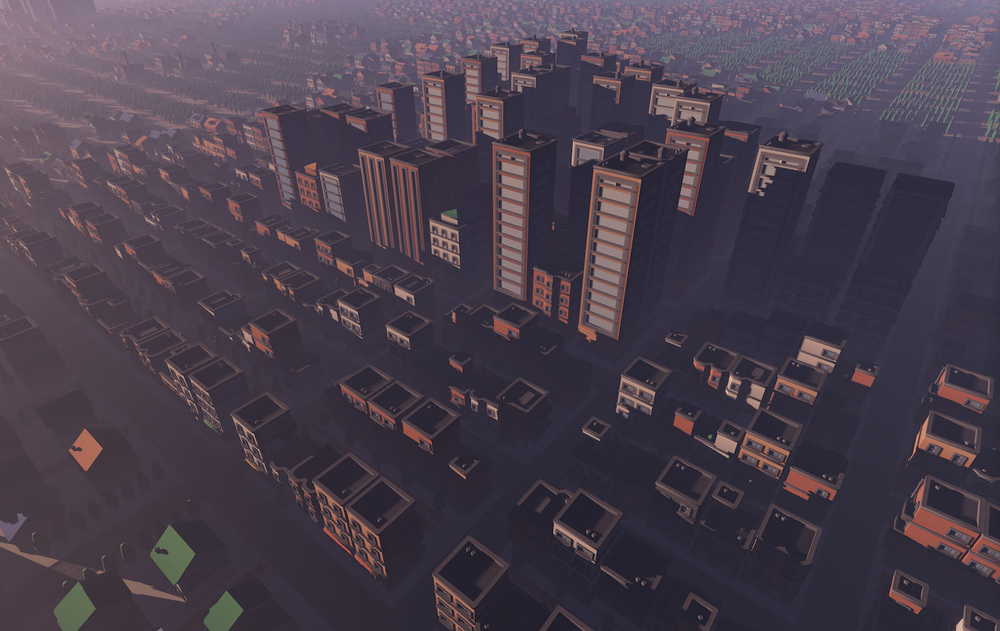

# Flecs engine
A fast, portable, low footprint, opinionated (but hackable), flecs native game engine.

The project is still WIP and currently only works on MacOS.

## Usage
Build & run the engine:
```sh
cmake -S . -B build
cmake --build build
./build/flecs_engine
```

## Why should I use this?
You should probably not use this, unless:
- you want to quickly prototype ideas
- you want to build an engine but not start from 0
- you're OK with the limitations of the engine

## Features

### Geometry
- Primitive shapes:
  - Quad
  - Box
  - Triangle
  - TrianglePrism
  - RightTriangle
  - RightTrianglePrism
- Primitive meshes (parameterized mesh cache):
  - Cone
  - Cylinder
  - Sphere
  - IcoSphere
  - HemiSphere
  - NGon
- Meshes
- Instanced rendering

### Assets
- glTF loader
- PNG loader
- DDS loader
- HDR / EXR loader (for HDRI)

### Materials
- Metallic
- Roughness
- Cubemap based reflections
- Emissive
- Transmissive (rough/smooth objects)
- PBR textures
- Per-instance materials
- Shared materials

### Lighting
- Directional light
- Point lights
- Spot lights
- Clustered light rendering
- Cascading shadow maps
- Image based lighting

### Atmosphere
- Dynamic atmosphere
- Dynamic atmosphere IBL
- Distance fog
- Height based fog
- Sun disk
- Moon disk (w/phases)
- Starfield
- Time of day system

### Effects
- Bloom
- SSAO
- Screen space sun shafts
- Auto exposure
- Tony McMapFace tone mapping

### Misc
- Input handling
- Camera controller
- Movement systems
- Tracy profiling
- Image-based rendering regression testing
- MSAA
- GPU frustum culling
- Hi-Z occlusion culling
- Render to image

## Dependencies
- cglm
- cgltf
- glfw
- stb_image
- tinyexr
- tracy

## Assets used
- [Kronos sample assets](https://github.com/KhronosGroup/glTF-Sample-Assets)
- [Niagra bistro](https://github.com/zeux/niagara_bistro)
- [Kenney](https://kenney.nl/)

## Screenshots





